# Amazon Forecast No-code-workshop
*No code workshop to experiment on Amazon Forecast*

Introduction: Amazon Forecast is a machine learning service that provides prediction based on time series data provided by AWS.

## Region selection
Please check with your instructor about the regions where you will be working for this hands-on. You can change it by selecting the region name in the upper right of the screen:

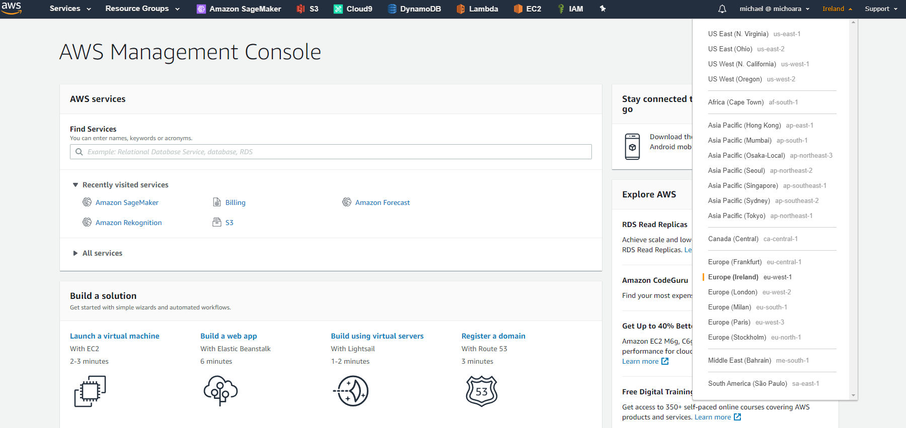
 
## Download data for learning
[This CSV file](data/electricityusagedata.csv) includes power consumption data for individual households. Here's a snippet of this file:
 
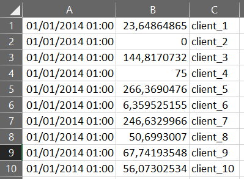

In this hands-on workshop, future power consumption will be predicted based on this time series data. Amazon Forecast can process any time series data, so sales data, inventory consumption data, etc. can also be used.

## Note down the S3 bucket
1. Please open  in SageMaker Studio and execute Cell #2 to get the default S3 bucket name.

2. Go to S3 service console, select the S3 bucket, press **Upload**

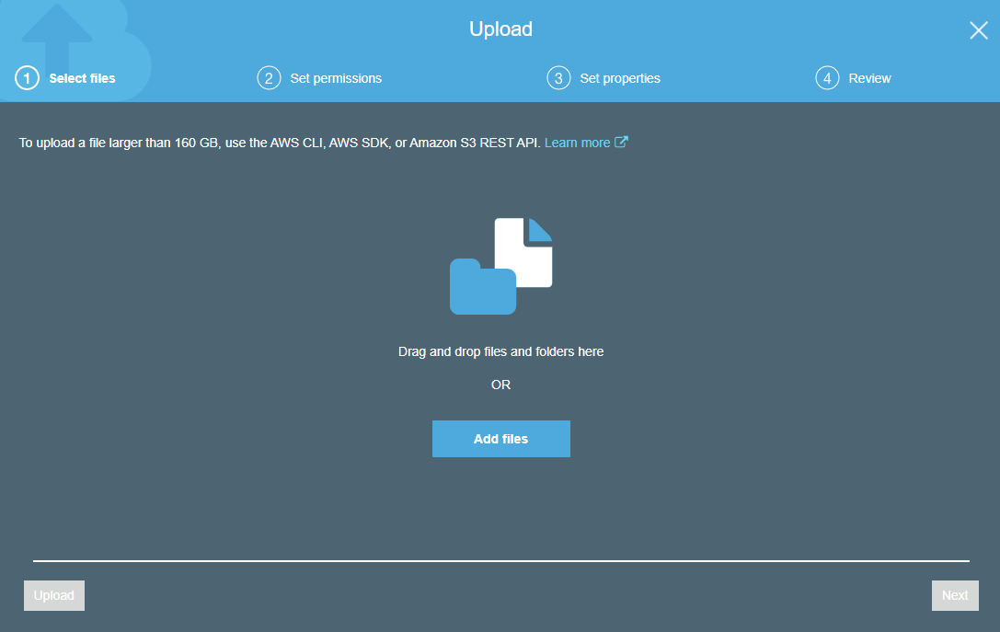

3. Select `electricityusagedata.csv` downloaded earlier by dragging and dropping the file or by clicking the **Add files** button.

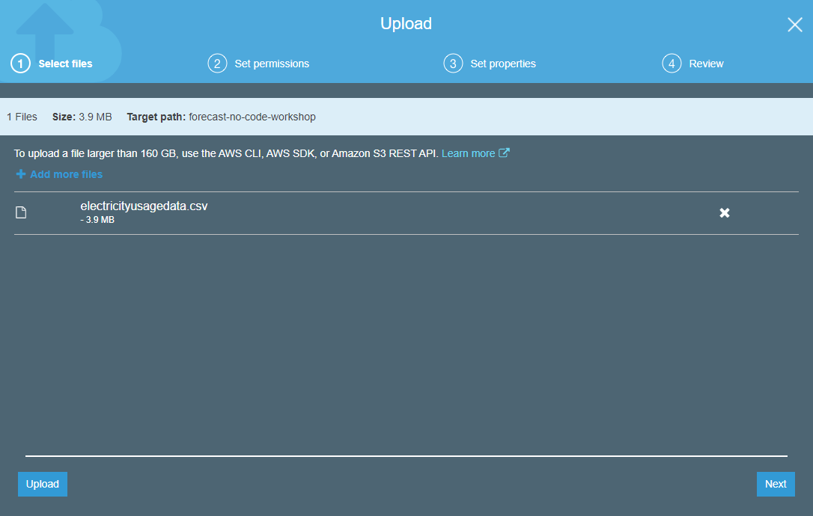

4. Click the **Upload** button at the bottom left of the screen to start uploading.

5. The following screen will be displayed when the upload is completed.

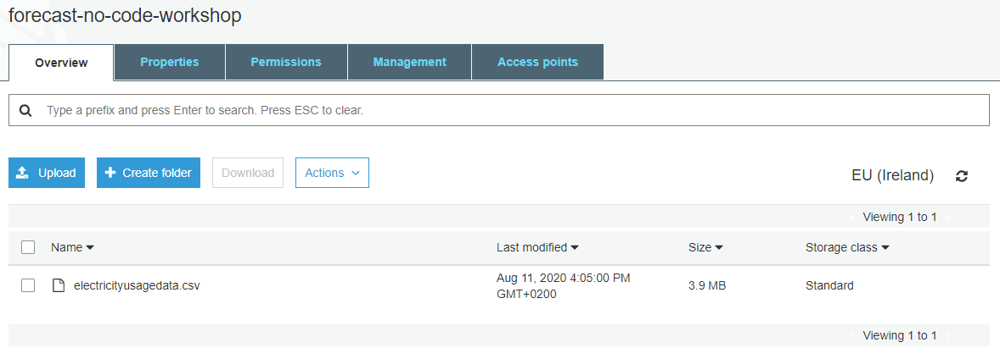

## Note down the IAM role
1. Please open  in SageMaker Studio and execute Cell #2 to get the default IAM role ARN value.

## Go to the Forecast screen in the same way as S3 and IAM.

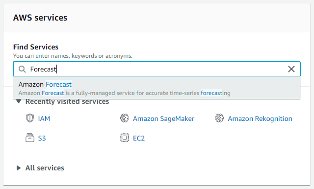

1. Click on **View dataset groups** button on the welcome screen:

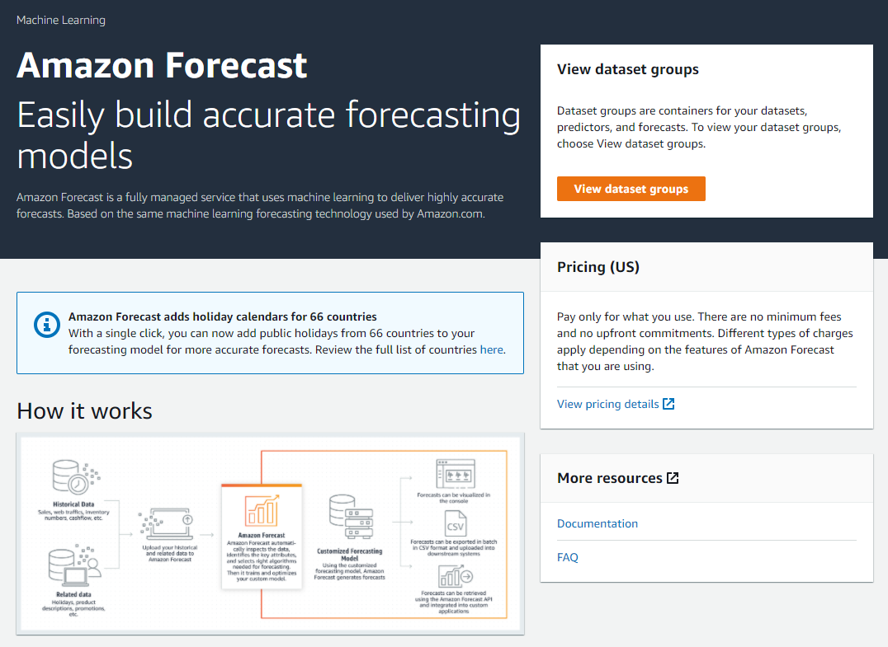

Then, press **Create dataset group** on the interface below: a dataset group is a collection of complimentary datasets that detail a set of changing parameters over a series of time. After creating a dataset group, you use it to train one or more predictors.

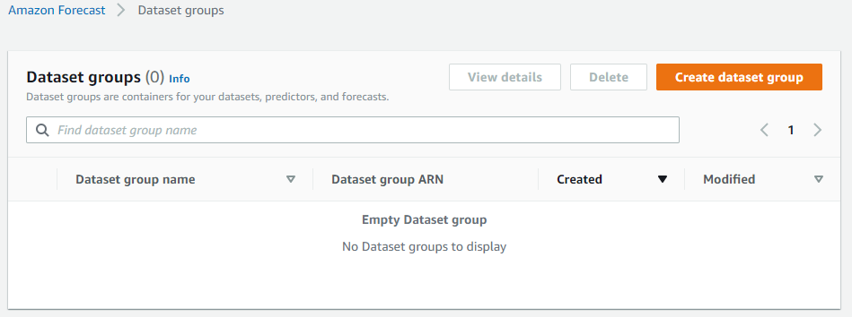

2. Enter an appropriate name in **Dataset group name**, set **Forecasting domain** to **Custom** and press **Next**. A *dataset domain* specifies a pre-defined dataset schema for a common use case, and does not impact model algorithms or hyperparameters.

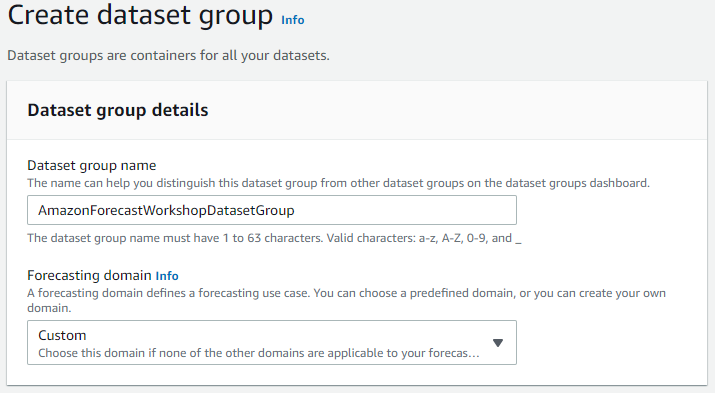

3. Enter an appropriate name in **Dataset name**. Select **hour** for **Frequency of your data**: this value must match the time series interval of the original data to be learned.

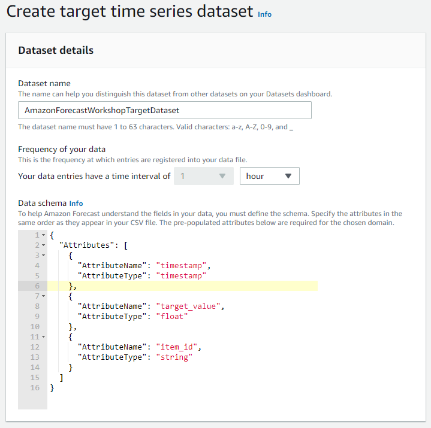

4. To match the value of **Data Schema** to the order of the original data to be trained on, replace the data schema by the following value:

```json
{
  "Attributes": [
    {
      "AttributeName": "timestamp",
      "AttributeType": "timestamp"
    },
    {
      "AttributeName": "target_value",
      "AttributeType": "float"
    },
    {
      "AttributeName": "item_id",
      "AttributeType": "string"
    }
  ]
}
```

5. Press **Next**

6. If the following green bar is displayed, the dataset is set correctly:

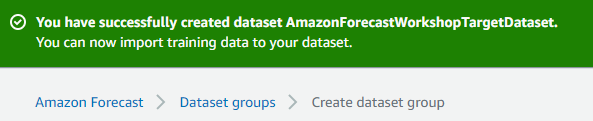

Next, click **Import**

7. Enter an appropriate name in **Data set import name**. **Time stamp format** must be a notation that matches the original data to be imported, but in this hands-on the original data and the default value are the same, so leave it as it is. Paste the newly created IAM Role ARN that you copied in **Custom IAM role ARN**.

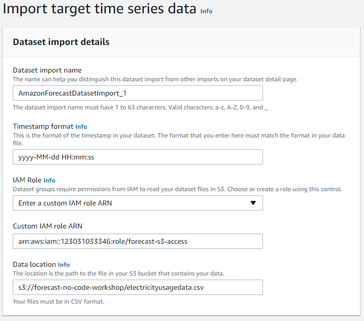

8. Enter the source data for learning that you uploaded earlier in **Data location** in the following format, and click **Start Import**: `s3://<bucket name>/<file name>`
(Please note that it is different from the URI that can be accessed from the outside).

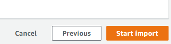

9. Import will start and the following screen will appear:

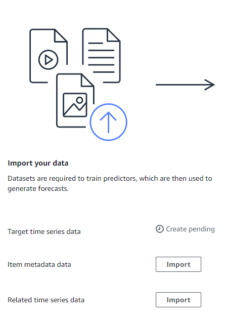

10. The import is complete when **Active** is displayed in green as shown below. Note that each dataset group can have up to three datasets, one of each dataset type: target time series (like the one we just created), related time series, and item metadata.

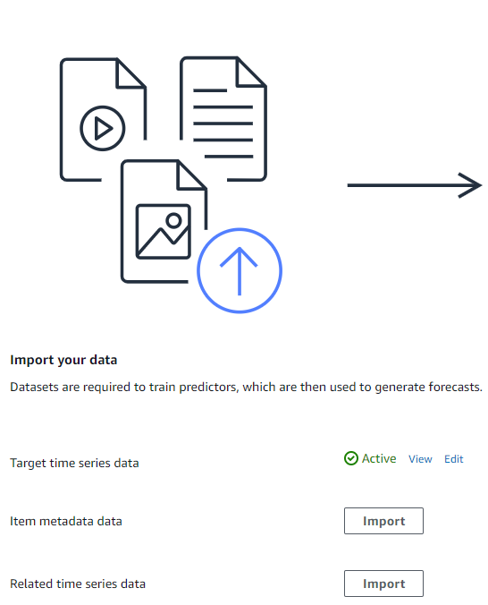

## Learning
Now that the data has been imported, we can start learning a new model from these data. In Amazon Forecast, we do this by creating a new predictor:

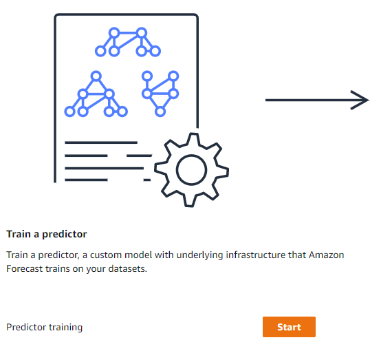

1. Press **Start** in the **Train a predictor** section:

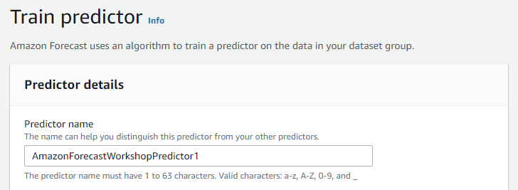

2. Enter an appropriate name in Predictor name. **Forecast horizon** is the time interval for forecasting. In this hands-on, enter **36** to create a forecast of 36-intervals long (for 36 hours in this case):

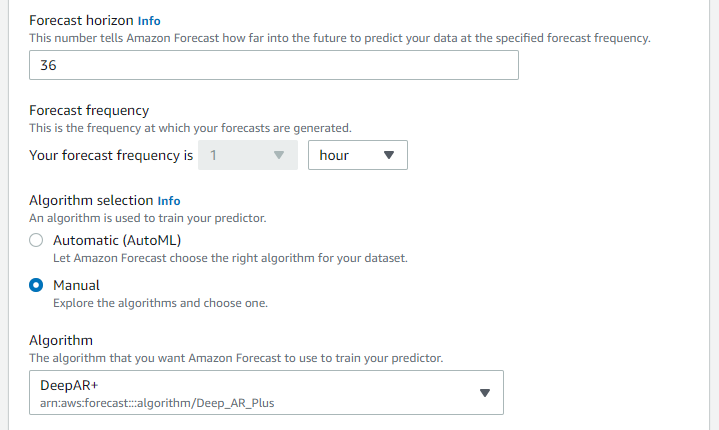

3. **Forecast frequency** must be the same as the original data, so select **hour**. Leave **Algorithm selection** as **Manual** and select **ETS** for **Algorithm**.

4. Press **Train predictor** with all remaining values unchanged.

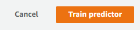

5. Learning has started when the following message is displayed:

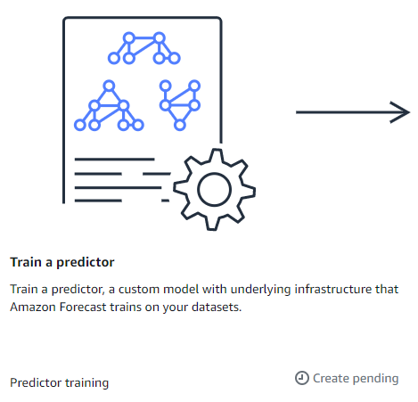

6. Learning is completed when **Active** is displayed as shown below:

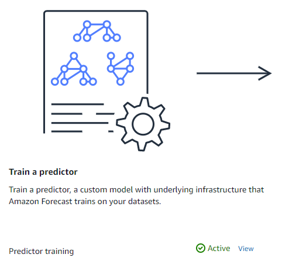

## Creating a prediction endpoint
Now that learning is done, let's create an endpoint to request some predictions:

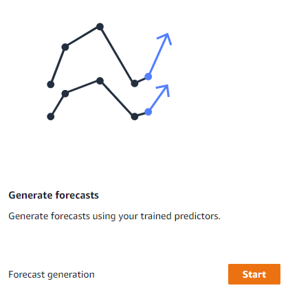

1. Click the **Start** button next to the **Generate forecasts** section on the right side of the screen.
 
2．　Enter an appropriate name in **Forecast name**. From the **Predictor** dropdown, select the name you gave to the model trained earlier:

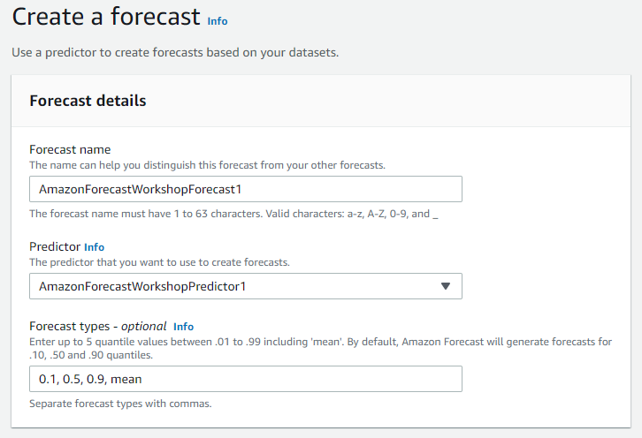
 
3. Press the **Create a forecast** button.
 
4. This will take some time, as the prediction endpoint will start:

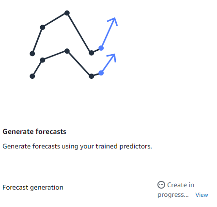

5. The following display shows our predictor is ready to servce predictions. You can now predict!

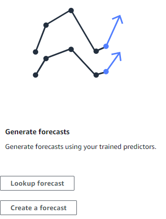

## Make a prediction
Let's make a prediction from the trained predictor:
1. Press **Look up Forecast**. Then, for **Forecast**, select the name of the endpoint created earlier from the drop-down:

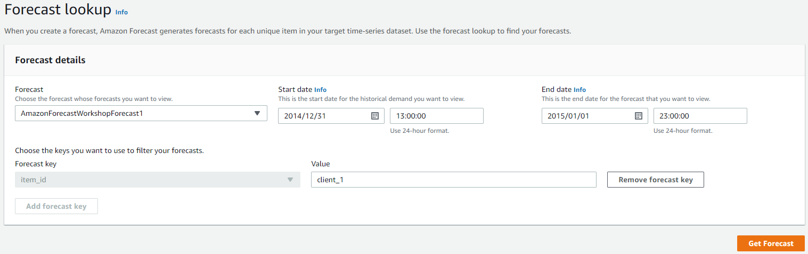

* *Start Date* – Enter `12/31/2014`. Leave the default time of `00:00:00`.
* *End date* – Enter `01/02/2015`. Change the time to `12:00:00`.
* Enter the ID of a client included in the initial data source data in [Value]. (Example: `client_2`)

2.　 Pressing [Get Forecast] will output the prediction as a graph as shown below:

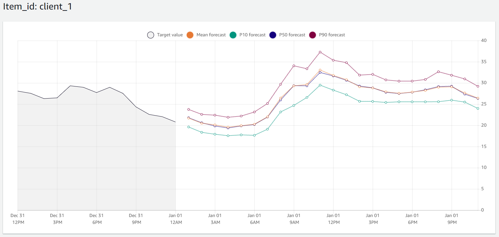
 
The numbers P10, P50, and P90 have a probability of 10%, 50%, and 90%, respectively, and include actual demand. It means that there is an 80% chance (90 - 10 = 80) of being within that range (below the highest value). The larger the number of PXX, the higher the probability that the prediction will fall within that value, but the blur width will increase, so we recommend using the value of P50 first.

# Conclusion
---
If you want to see how to perform the same kind of operations by using the Amazon Forecast API, you can follow the notebooks and start by the data preparation one.